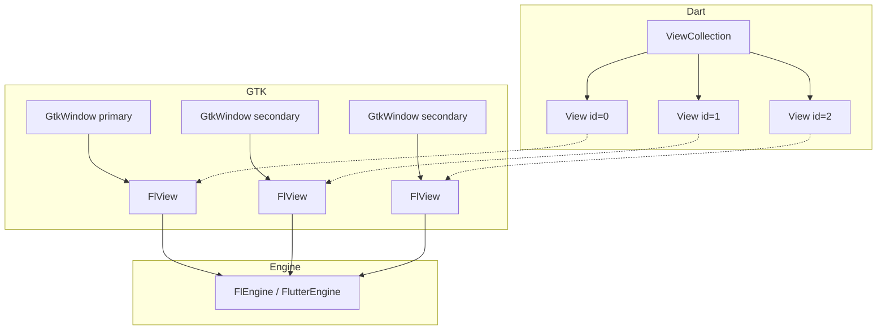
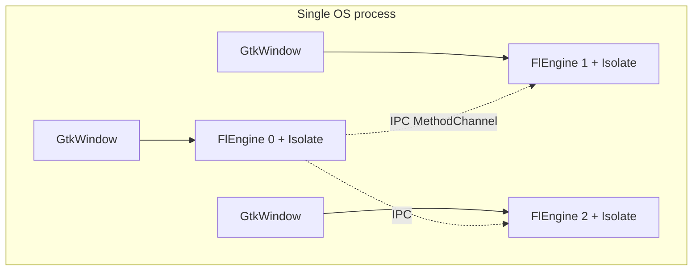
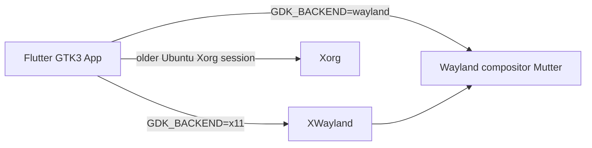

# Diagrams — Architecture

## Shared-engine multi-view (multiview_desktop)

```mermaid
flowchart TB
  subgraph Dart
    VC[ViewCollection]
    V0[View id=0]
    V1[View id=1]
    V2[View id=2]
    VC --> V0
    VC --> V1
    VC --> V2
  end

  subgraph Engine
    FE[FlEngine / FlutterEngine]
  end

  subgraph GTK
    W0[GtkWindow primary]
    W1[GtkWindow secondary]
    W2[GtkWindow secondary]
    F0[FlView]
    F1[FlView]
    F2[FlView]
    W0 --> F0
    W1 --> F1
    W2 --> F2
  end

  V0 -.-> F0
  V1 -.-> F1
  V2 -.-> F2
  F0 --> FE
  F1 --> FE
  F2 --> FE
```

## Multi-engine (desktop_multi_window style)

```mermaid
flowchart TB
  subgraph Proc[Single OS process]
    E0[FlEngine 0 + Isolate]
    E1[FlEngine 1 + Isolate]
    E2[FlEngine 2 + Isolate]
    W0[GtkWindow]
    W1[GtkWindow]
    W2[GtkWindow]
    W0 --> E0
    W1 --> E1
    W2 --> E2
  end
  E0 -.->|IPC MethodChannel| E1
  E0 -.->|IPC| E2
```

## Ubuntu 26 session path

```mermaid
flowchart LR
  App[Flutter GTK3 App]
  App -->|GDK_BACKEND=wayland| WL[Wayland compositor Mutter]
  App -->|GDK_BACKEND=x11| XW[XWayland]
  XW --> WL
  App -->|older Ubuntu Xorg session| X11[Xorg]
```
