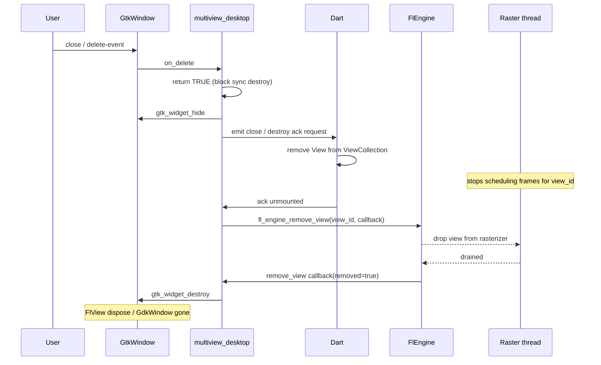
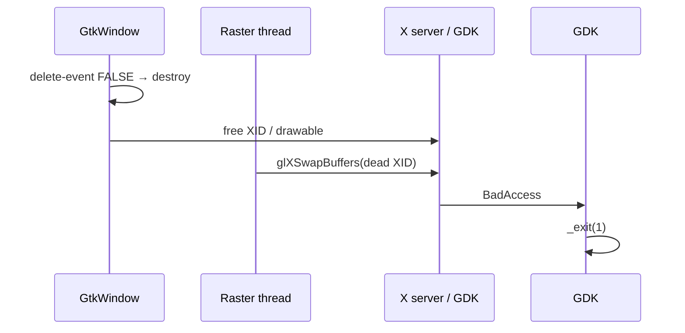
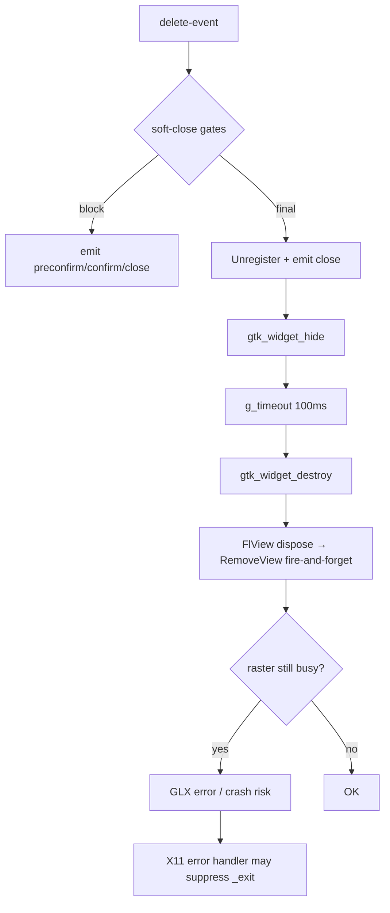

# Diagrams — Close lifecycle

## Идеальный безопасный порядок

```mermaid
sequenceDiagram
  participant User
  participant GTK as GtkWindow
  participant Plugin as multiview_desktop
  participant Dart
  participant Engine as FlEngine
  participant Raster as Raster thread

  User->>GTK: close / delete-event
  GTK->>Plugin: on_delete
  Plugin->>Plugin: return TRUE (block sync destroy)
  Plugin->>GTK: gtk_widget_hide
  Plugin->>Dart: emit close / destroy ack request
  Dart->>Dart: remove View from ViewCollection
  Note over Raster: stops scheduling frames for view_id
  Dart->>Plugin: ack unmounted
  Plugin->>Engine: fl_engine_remove_view(view_id, callback)
  Engine-->>Raster: drop view from rasterizer
  Raster-->>Engine: drained
  Engine->>Plugin: remove_view callback(removed=true)
  Plugin->>GTK: gtk_widget_destroy
  Note over GTK: FlView dispose / GdkWindow gone
```

## Типичный краш (sync destroy)

```mermaid
sequenceDiagram
  participant GTK as GtkWindow
  participant Raster as Raster thread
  participant X11 as X server / GDK

  GTK->>GTK: delete-event FALSE → destroy
  GTK->>X11: free XID / drawable
  Raster->>X11: glXSwapBuffers(dead XID)
  X11->>GDK: BadAccess
  GDK->>GDK: _exit(1)
```

## Текущий путь multiview_desktop (упрощённо)

```mermaid
flowchart TD
  A[delete-event] --> B{soft-close gates}
  B -->|block| C[emit preconfirm/confirm/close]
  B -->|final| D[Unregister + emit close]
  D --> E[gtk_widget_hide]
  E --> F[g_timeout 100ms]
  F --> G[gtk_widget_destroy]
  G --> H[FlView dispose → RemoveView fire-and-forget]
  H --> I{raster still busy?}
  I -->|yes| J[GLX error / crash risk]
  I -->|no| K[OK]
  J --> L[X11 error handler may suppress _exit]
```
